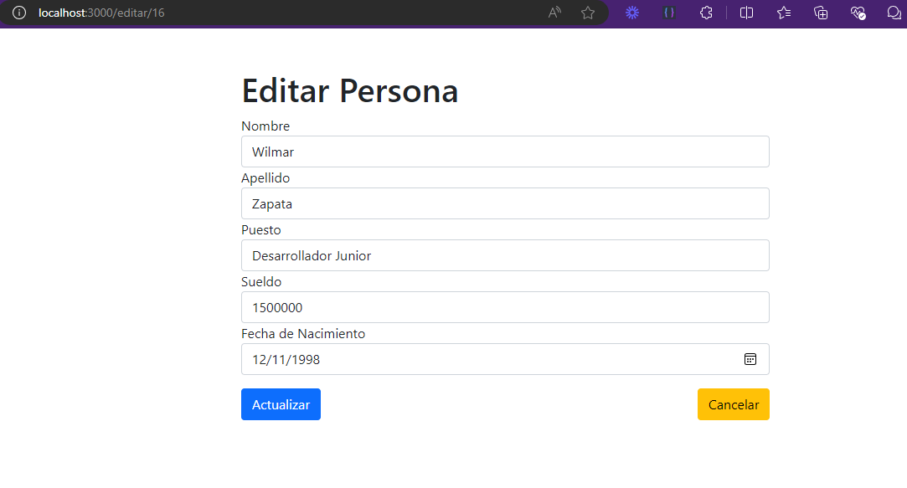

# Proyecto Frontend con React - Examen

## Descripción

Este proyecto es una aplicación web que permite crear personas, editarlas y eliminarlas. Se utiliza React como librería y NodeJS como servidor.

## Requerimientos

- NodeJS 18.x.x
- NPM 10.x.x

## Instalación

1. Clonar el repositorio en tu máquina local.

```bash
   git clone https://github.com/tonysoft2018/tesffullstack.git
   cd tesffullstack
   git checkout zapata_frontend
   cd zapata_frontend
```

2. Ejecutar el comando `npm install` para instalar las dependencias del proyecto.
3. Ejecutar el comando `npm start` para iniciar el servidor de desarrollo.
4. Abrir el navegador en `http://localhost:3000` para ver la aplicación en acción.


## Tener presente

- El proyecto se ha dividido en dos partes: el backend y el frontend.
- El backend se encarga de manejar las peticiones entrantes y las respuestas salientes.
- El frontend se encarga de mostrar la interfaz de usuario y recibir las peticiones de usuario.
- El backend y el frontend se comunican mediante peticiones HTTP.
- El backend utiliza Spring Boot para la configuración y la librería de JavaScript react para el frontend.
- El backend utiliza JSON para la serialización y deserialización de los objetos.
- El backend utiliza CORS para permitir la comunicación entre el frontend y el backend.

## El backend esta en la rama zapata_backend

## El frontend esta en la rama zapata_frontend

## El script para crear la base de datos esta en la rama zapata_bd


## Capturas de pantalla

### formulario para mostrar el listado de las personas.


### formulario para crear una persona.


### formulario para editar una persona.

